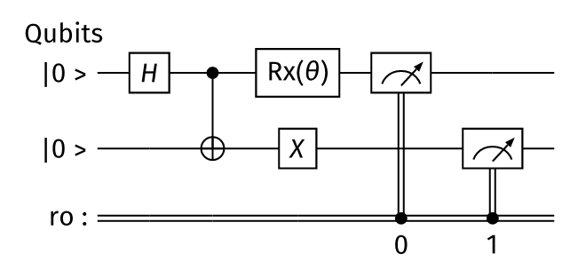

# qollage

Typesetting tool for the qoqo/roqoqo quantum toolkit by [HQS Quantum Simulations](https://quantumsimulations.de).

This repository contains two components:

* roqollage: the core rust library that builds on the roqoqo rust library.  
* qollage: the python interface to roqollage that uses the qoqo python interface.

This repository uses the [Typst](https://github.com/typst/typst) typesetting system with the [quill](https://github.com/Mc-Zen/quill/tree/main) package to create quantum circuits.
## qollage

[](https://hqsquantumsimulations.github.io/qollage/)
[](https://github.com/HQSquantumsimulations/qollage/actions)
[](https://pypi.org/project/qollage/)
[](https://pypi.org/project/qollage/)


Drawing tool for the qoqo quantum toolkit by [HQS Quantum Simulations](https://quantumsimulations.de).

Qollage provides the save_circuit and draw_circuit functions that allows users to translate a qoqo circuit into a png image and either save it or display it.  
These two functions will create a cache folder named `.qollage` containing fonts and Typst libraries in the current directory. You are free to delete it but the files will be downloaded again at the next use.  
It also provides the circuit_to_typst_str that can be used to generate a string that can be copy pasted in the Typst interpreter if you want to edit the circuit further.  
The latest qoqo gates might not be implemented in qollage yet.
A circuit containing not supported operations can't be drawn and will result in an error.  
If a gate has a string parameter it will be printed inside a typst mathematical expression and the typst symbols will be replaced.  
Alphanumerical expressions will be preprocessed, if it doesn't represent any typst symbol it will be escaped by surrounding quotes.  
`qoqo.operations.RotateX(0, "theta")` will be formatted as `θ`.  
`qoqo.operations.RotateX(0, "param")` will be escaped with quotes and kept as it is.  
`qoqo.operations.RotateX(0, "\"param\"")` will not be accepted because the extra quotes will interfere with the quotes added to escape `param`.  
For more informations see [the documentation](https://typst.app/docs/reference/math/).  
Here is the [list of symbols](https://typst.app/docs/reference/symbols/sym/) but be aware that not all of them are supported by [the font used](https://ctan.math.washington.edu/tex-archive/fonts/firamath/firamath-specimen.pdf).

### Example:

In a jupyter cell:
```python
from qoqo import Circuit, operations as ops
from qollage import draw_circuit

circuit = Circuit()
circuit += ops.DefinitionBit("ro", 2, True)
circuit += ops.Hadamard(0)
circuit += ops.CNOT(0, 1)
circuit += ops.PauliX(1)
circuit += ops.RotateX(0, "theta")
circuit += ops.MeasureQubit(0, "ro", 0)
circuit += ops.MeasureQubit(1, "ro", 1)

draw_circuit(circuit)
```
It will output:



## roqollage

[](https://crates.io/crates/roqollage)
[](https://github.com/HQSquantumsimulations/qollage/actions)
[](https://docs.rs/roqollage/)


Typesetting tool for the roqoqo quantum toolkit by [HQS Quantum Simulations](https://quantumsimulations.de).

roqollage provides the circuit_to_image function that allows users translate a roqoqo circuit into a DynamicImage of the circuit's representation.  
Not all roqoqo operations have a corresponding Typst expression.  
Circuits containing operations without a corresponding expression can not be translated.

## General Notes

This software is still in the beta stage. Functions and documentation are not yet complete, can contain bugs and breaking changes can occur.

## Known issue

If there are many gates that are represented by a slice the slice label might overlap or there might be some gaps between the slices.  
If there is a gate represented by a slice inside a circuit used in a gate (i.e. PragmaLoop) the slice will got through all the qubits not only the ones used by the gate' circuit. Issues mentionned in the first line also applies here.

## Contributing

We welcome contributions to the project. If you want to contribute code, please have a look at CONTRIBUTE.md for our code contribution guidelines.
